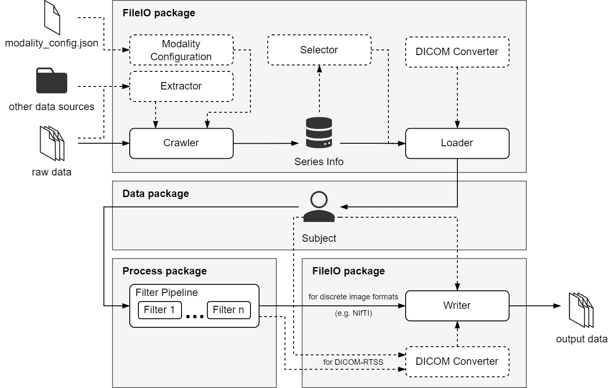

.. toctree::
   :maxdepth: 3
   :caption: Contents:
   :hidden:

   installation
   examples
   api
   change_history
   acknowledgment

Welcome to PyRaDiSe's Documentation
===================================

PyRaDiSe (Python package for Radiotherapy-oriented and DICOM-based auto-Segmentation) is an open-source Python package
for building clinically applicable  radiotherapy-oriented auto-segmentation solutions. This package addresses two main
challenges of auto-segmentation in clinical radiotherapy: data handling and conversion from and to DICOM-RTSS. Besides a
radiotherapy-oriented data model and conversion capabilities, PyRaDiSe provides a profound set of extensible processing
filters for fast prototyping and development of clinically deployable auto-segmentation pipelines. Therefore, PyRaDiSe
is a highly flexible and extensible toolbox, allowing for narrowing the gap between data science and clinical
radiotherapy research and speeding up development cycles.

Main Features
-------------
The main features of PyRaDiSe are data handling, conversion from and to DICOM-RTSS, and data processing,
including deep learning model inference. The intended use of PyRaDiSe in the radiotherapy environment is depicted in
:numref:`Fig. %s <fig-overview>`. The DICOM and other discrete medical image file formats, such as NIFTI, are imported
into the provided data model using the :mod:`~pyradise.fileio` package. In contrast to the standard way of loading
DICOM data, this package provides comprehensive and flexible import routines that consider data relation details and
automate import steps, such as registering DICOM images if DICOM registration files are available. However, in some
cases, the DICOM standard does not provide sufficient information for automation, requiring minimal human interaction
for resolution. In addition, discrete medical images also suffer from the lack of identification data needed for
automation. However, the :mod:`~pyradise.fileio` package offers the necessary methods to address these issues with
flexible approaches and prototypes. Furthermore, the :mod:`~pyradise.fileio` package provides routines to select
specific entities from the available data before loading by generating filterable pre-loading information
(so-called :class:`~pyradise.fileio.series_info.SeriesInfo`) so that the computation time and memory usage
for loading is minimal. Finally, after the data is loaded, it is represented using the data model implemented in the
:mod:`~pyradise.data` package. All downstream tasks are performed using the simple and extensible radiotherapy-oriented
data model from this step on.

After loading, the data is either converted and written to a file or processed using routines from the
:mod:`~pyradise.process` package. This package includes functionality and prototypes for pre-processing, deep
learning model inference, and post-processing with a similar mode of operations as well-known medical image libraries,
such as SimpleITK or ITK. However, in contrast to other libraries, the :mod:`~pyradise.process` package offers a
mechanism for guaranteeing reproducibility and a limited method for invertibility that will eventually be extended.

After processing or loading, the altered data can be written to disk using a versatile writer from the
:mod:`~pyradise.fileio` package to save the data as either a discrete image file or as DICOM-RTSS. In addition, some of
the offered writers provide the additional functionality to copy the existing data from the source to the
target directory. This feature is handy if the developed auto-segmentation solution will be deployed to the clinical
environment or the cloud, where the original input data should remain unmodified.

    Schematic illustration of PyRaDiSe in the radiotherapy environment

Getting Started
---------------
If you are new to PyRaDiSe we recommend to start with the :doc:`installation` and :doc:`examples` pages to get used
to the package. Furthermore, the :doc:`api` page provides an overview of the available modules and classes.

If you have used PyRaDiSe before, please consider the :doc:`change_history` page for the latest changes. We also want
to encourage you to make pull requests to the `PyRaDiSe repository on GitHub <https://github.com/ubern-mia/pyradise>`_
if you have any improvements or suggestions. Furthermore, we would be happy to hear from you if you have any questions
or comments.

Finally, the :doc:`acknowledgment` page provides an overview of the acknowledgments for the development of PyRaDiSe.

Citation
--------
If you use PyRaDiSe in your research, please acknowledge it by citing our paper:

BibTeX entry:

.. code-block:: none

    @article{Ruefenacht2022a,
    author = {Ruefenacht, Elias and Kamath, Amith and Suter, Yannik and Reyes, Mauricio},
    doi = {TO BE CHANGED},
    issn = {TO BE CHANGED},
    journal = {Computer Methods and Programs in Biomedicine},
    pages = {TO BE CHANGED},
    title = {{PyRaDiSe: TO BE CHANGED}},
    volume = {TO BE CHANGED},
    year = {2022},
    }

Indices and tables
------------------

* :ref:`genindex`
* :ref:`modindex`
* :ref:`search`