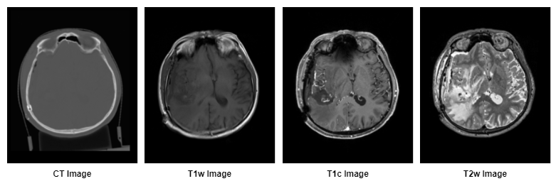

Modality Module
===============
Module: :mod:`pyradise.data.modality`

.. module:: pyradise.data.modality
    :noindex:

The :mod:`~pyradise.data.modality` module provides the functionality to manage the :class:`Modality` information of a
certain :class:`~pyradise.data.image.IntensityImage`.

*Figure: Examples of different modalities.*

|

.. automodule:: pyradise.data.modality
    :show-inheritance:
    :members:
    :inherited-members: