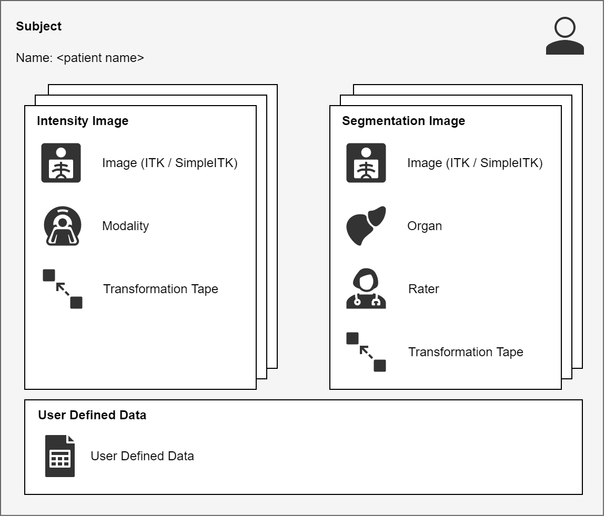
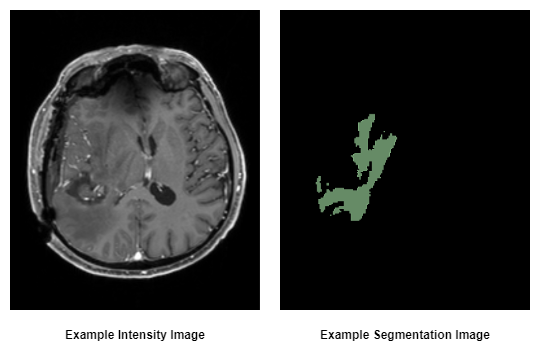

.. role:: any

.. automodule:: pyradise.data

Data Package
============

The :mod:`~pyradise.data` package contains the data model for PyRaDiSe which will be used during loading
(see :mod:`pyradise.fileio.loading` module), processing (see :mod:`pyradise.process` package) and writing (see
:mod:`pyradise.fileio.writing` module). The goal of the data model design is to provide an simple, lightweight, and
extensible RT-oriented interface for the user to work with the data. First, simple because handling data with a
simple interface should be easy and intuitive. Second, lightweight because the data model should not add a lot of
overhead because processing of medical images typically requires large amounts of memory. Third, extensible because the
data model should be easily extendable to support new features and new data types such as for example DICOM Dose Plans.

The :class:`~pyradise.data.subject.Subject` is the top-level data holding container combining all necessary
subject-level information such as the subject's name, the intensity and segmentation images and additional user
defined data in one common data structure. Typically, the :class:`~pyradise.data.subject.Subject` is created directly
by a :class:`~pyradise.fileio.loading.SubjectLoader` when loading data from disk. However, it can also be constructed
manually in order to render feasibility for working with other libraries such as `MONAI <https://monai.io/>`_.

The :class:`~pyradise.data.subject.Subject` comprises of a list of :class:`~pyradise.data.image.IntensityImage` and
:class:`~pyradise.data.image.SegmentationImage` images with each image possessing additional information about the
image content such as the :class:`~pyradise.data.modality.Modality` or the :class:`~pyradise.data.organ.Organ`
segmented. Furthermore, each image contains a :class:`~pyradise.data.taping.TransformTape` which is used to keep
track of all necessary physical property (i.e. origin, direction, spacing, size) changes during processing. The
:class:`~pyradise.data.taping.TransformTape` provides also functionality to revert the changes to the original
physical properties by playback the recorded changes. Each :class:`~pyradise.data.image.Image` type posses
distinctive content-related information which are enlisted below:

**Intensity Image**

In addition to the image data and the transform tape, an :class:`~pyradise.data.image.IntensityImage` contains
information about the :class:`~pyradise.data.modality.Modality`. The :class:`~pyradise.data.modality.Modality` is used
to distinguish between different image modalities and their details such as CT, PET, or MR. The naming of the
different :class:`~pyradise.data.modality.Modality` instances is determined during the loading of
the :class:`~pyradise.data.subject.Subject` using either a modality configuration file or a
:class:`~pyradise.fileio.extraction.ModalityExtractor`.

**Segmentation Image**

Additionally to the image data and the transform tape, a :class:`~pyradise.data.image.SegmentationImage` contains
information about the :class:`~pyradise.data.organ.Organ` segmented on the image and the
:class:`~pyradise.data.rater.Rater` who generated the segmentations / contours. By design, each
:class:`~pyradise.data.image.SegmentationImage` instance should contain a single organ / label to allow for simple
processing. As explained earlier this is not a hard constraint and can be circumvented in appropriate cases such as
for example if one needs to output multi-label segmentations.

|

*Figure: Schematic illustration of the subject and the images.*

|

Subject Module
--------------------
Module: :mod:`pyradise.data.subject`

.. module:: pyradise.data.subject
    :noindex:

The subject module provides the :class:`Subject` which is the main data holding object in PyRaDiSe. The subject is
constructed during loading an is used through the whole processing in PyRaDiSe.

|

.. automodule:: pyradise.data.subject
    :show-inheritance:
    :members:
    :inherited-members:

Image Module
--------------------
Module: :mod:`pyradise.data.image`

.. module:: pyradise.data.image
    :noindex:

The image module provides the abstract :class:`Image` class and the implementations for the :class:`IntensityImage` and
:class:`SegmentationImage` classes. If a new image type is required for a certain task, the new image type should be
derived from the :class:`Image` class.

*Figure: Examples of an intensity image and a segmentation image.*

|

.. automodule:: pyradise.data.image
    :show-inheritance:
    :members:
    :inherited-members:

Taping Module
--------------------
Module: :mod:`pyradise.data.taping`

.. module:: pyradise.data.taping
    :noindex:

The :mod:`~pyradise.data.taping` module provides the abstract :class:`Tape` mechanism for recording and playback
arbitrary data and an implementation for recording and playback transformations applied to images (see
:class:`TransformTape`).

|

.. automodule:: pyradise.data.taping
    :show-inheritance:
    :members:
    :inherited-members:

Modality Module
--------------------
Module: :mod:`pyradise.data.modality`

.. module:: pyradise.data.modality
    :noindex:

The :mod:`~pyradise.data.modality` module provides the functionality to manage the :class:`Modality` information of a
certain :class:`~pyradise.data.image.IntensityImage`.

.. image:: _static/data_image_2.png
    :width: 800
    :align: center
    :alt: examples of different modalities

*Figure: Examples of different modalities.*

|

.. automodule:: pyradise.data.modality
    :show-inheritance:
    :members:
    :inherited-members:

Organ Module
--------------------
Module: :mod:`pyradise.data.organ`

.. module:: pyradise.data.organ
    :noindex:

The :mod:`~pyradise.data.organ` module provides the functionality to manage information about the :class:`Organ` of a
certain :class:`~pyradise.data.image.SegmentationImage`.

|

.. automodule:: pyradise.data.organ
    :show-inheritance:
    :members:
    :inherited-members:

Rater Module
--------------------
Module: :mod:`pyradise.data.rater`

.. module:: pyradise.data.rater
    :noindex:

The :mod:`~pyradise.data.rater` module provides the functionality to manage information about the expert :class:`Rater`
who generated the segmentation on a certain :class:`~pyradise.data.image.SegmentationImage`. The :class:`Rater` can
take any name such that it can be used to identify a human expert as well as an auto-segmentation algorithm
(e.g. a deep learning model).

|

.. automodule:: pyradise.data.rater
    :show-inheritance:
    :members:
    :inherited-members:

