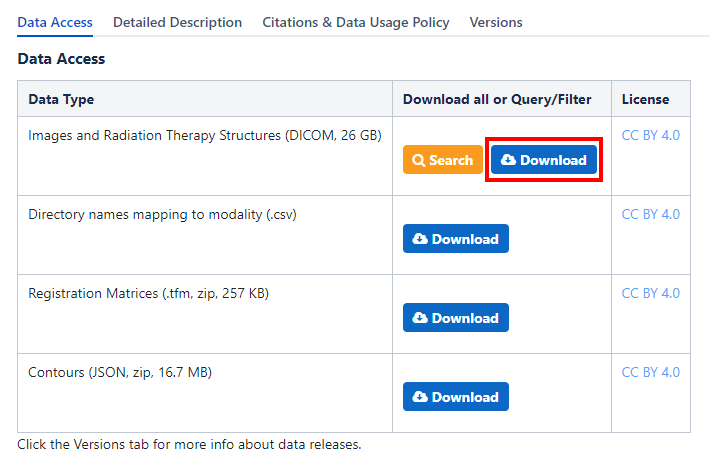
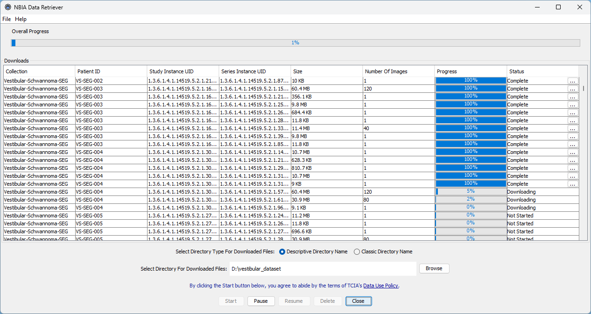
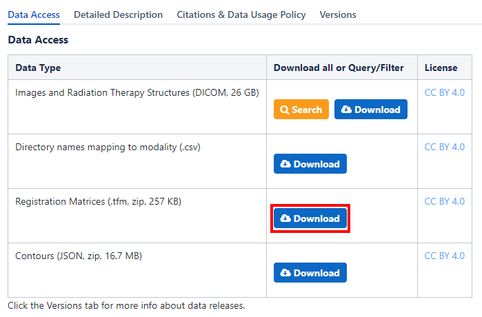

TCIA General Tutorial / Vestibular-Schwannoma SEG Dataset
=========================================================

The `Cancer Imaging Archive (TCIA) <https://www.cancerimagingarchive.net/>`_ is a service which de-identifies and
hosts a large publicly available archive of medical images of cancer. TCIA is funded by the Cancer Imaging Program (CIP),
a part of the United States National Cancer Institute (NCI), and is managed by the Frederick National Laboratory for
Cancer Research (FNLCR).

Currently, the TCIA contains over 180 datasets with public and restricted access. Because most of the datasets possess
a standardized file structure converting them with PyRaDiSe is straightforward. The following tutorial demonstrates
how to convert a DICOM-based TCIA dataset to the NIfTI format.

.. note::

    The following tutorial presumes that PyRaDiSe is installed. If not, heed the :ref:`installation section's <installation_section>`
    instructions or just run ``pip install pyradise`` in the appropriate terminal session.

Download the TCIA Dataset
-------------------------

TCIA provides the NBIA Data Receiver for downloading datasets. The NBIA Data Receiver can be downloaded
`here <https://wiki.cancerimagingarchive.net/display/NBIA/Downloading+the+NBIA+Data+Retriever+7.7>`_ and must be
installed prior to downloading any dataset from TCIA.

After installing the NBIA Data Receiver, downloading the chosen dataset from TCIA can take place. For this
tutorial, we use the `Vestibular-Schwannoma-SEG <https://wiki.cancerimagingarchive.net/pages/viewpage.action?pageId=70229053>`_
dataset as a representative example for a TCIA dataset.

Depending on the dataset selection, one may need to request access with TCIA and adopt the following conversion steps
slightly to the specific dataset. If running into problems converting other datasets, make sure there is no specific
tutorial for this dataset on the PyRaDiSe website providing more elaborate details for conversion. If a tutorial for a
specific dataset is missing on the website, contributions via a pull request on GitHub are warmly appreciated.

.. note::

    The Vestibular-Schwannoma-SEG dataset is a public dataset and does not require registration with TCIA.

To download the Vestibular-Schwannoma-SEG dataset, one needs to download the following primary dataset content:

    Screenshot of the Vestibular-Schwannoma-SEG TCIA website download block

After downloading the NBIA receiver file, one can open it with the installed NBIA Data Receiver to start the
downloading procedure.

    Screenshot of the NBIA Data Receiver downloading the Vestibular-Schwannoma-SEG dataset

.. note::

    Be aware that the download procedure may take hours, depending on the dataset size and the internet connection.

After the download procedure is finished successfully, one should have a data folder (i.e., `dataset_vestibular`)
containing the following sub-structure:

.. code-block:: bash

    dataset_vestibular
    └── manifest-1614264588831
        ├── metadata.csv
        └── Vestibular-Schwannoma-SEG
            ├── VS-SEG-001
            │   └── <subject-specific folder structure>
            ├── VS-SEG-002
            │   └── <subject-specific folder structure>
            └── ...

Download Additional Data
------------------------
For some datasets, additional data for the conversion is required, such as the registration matrices for aligning the
single images. Because this data is specific to the dataset, the steps of this tutorial may need adaptation for specific
circumstances.

For the Vestibular-Schwannoma-SEG dataset, the TCIA provides all registration matrices between the T1 and the T2 MR
images such that both images are co-registered after applying the registration transformations.

Please download the appropriate files from the TCIA website, unzip them (if applicable), and place them in the data
folder (i.e., `dataset_vestibular`).

    Screenshot of the additional data to download

The data structure of the data folder should be as follows:

.. code-block:: bash

    dataset_vestibular
    ├── manifest-1614264588831
    │   ├── metadata.csv
    │   └── Vestibular-Schwannoma-SEG
    │       ├── VS-SEG-001
    │       │   └── <subject-specific folder structure>
    │       ├── VS-SEG-002
    │       │   └── <subject-specific folder structure>
    │       └── ...
    └── registration_matrices
        ├── vs_gk_1_t1
        ├── vs_gk_1_t2
        └── ...

Generating the Modality Configuration Files
-------------------------------------------
PyRaDiSe provides multiple approaches for identifying (uni-modal) image series in a dataset. Because the conversion of
a dataset may be performed multiple times with different pre-processing procedures, using modality configuration files
for discriminating image series is best suited. So, the next step is the generation of these modality configuration
files for each subject in the dataset. To accomplish this, one needs to write a script reading the content of the
`metadata.csv` file and generating the appropriate modality configuration files.

The following script performs this task for the Vestibular-Schwannoma-SEG dataset and is easily adaptable for other
datasets:

.. code-block:: python

    import typing as t
    import os
    import csv

    from pyradise.fileio import ModalityConfiguration

    class VestibularSchwannomaModalityConfigGenerator:

        def __init__(self, manifest_dir_path: str):
            self.manifest_dir_path = manifest_dir_path

        def _read_meta_data(self) -> t.Dict[str, t.List[t.Dict[str, t.Any]]]:
            # read the meta data csv
            meta_data_path = os.path.join(self.manifest_dir_path, 'metadata.csv')
            with open(meta_data_path, 'r') as f:
                reader = csv.reader(f)
                raw_data_meta_data = list(reader)

            # sort the entries
            data = {}
            header_meta_data = raw_data_meta_data[0]
            for entry in raw_data_meta_data[1:]:
                entry_data = {}

                for identifier, value in zip(header_meta_data, entry):
                    entry_data[identifier] = value

                if data.get(entry_data['Subject ID'], None) is None:
                    data[entry_data['Subject ID']] = []
                data[entry_data['Subject ID']].append(entry_data)

            return data

        @staticmethod
        def _extract_sequence_info(meta_data: t.Dict[str, t.List[t.Dict[str, t.Any]]]
                                   ) -> t.Dict[str, t.List[t.Dict[str, t.Any]]]:
            # extract the sequence info for the MR images
            for subject, entry in meta_data.items():
                for entity_entry in entry:
                    if entity_entry.get('SOP Class Name') == 'MR Image Storage':
                        description = entity_entry.get('Series Description')

                        if description.upper().startswith('T1'):
                            entity_entry['AssignedModality'] = 'T1'
                        else:
                            entity_entry['AssignedModality'] = 'T2'

            return meta_data

        def _generate_modality_config(self,
                                      meta_data: t.Dict[str, t.List[t.Dict[str, t.Any]]]
                                      ) -> None:
            # get the subject base directory
            subject_base_path = [folder for folder in os.scandir(self.manifest_dir_path) if folder.is_dir()][0].path

            # get all the subject directories
            subject_paths = [folder for folder in os.scandir(subject_base_path) if folder.is_dir()]

            # loop through the subject directories
            for subject_path in subject_paths:
                print(f'Generating modality config for subject {subject_path.name}...')

                # get the subject-associated metadata
                subject_data = meta_data.get(subject_path.name)

                # build the modality config
                config = ModalityConfiguration()
                for entry in subject_data:

                    if entry.get('SOP Class Name') not in ('MR Image Storage', 'CT Image Storage'):
                        continue

                    config.add_modality_entry(sop_class_uid=entry.get('SOP Class UID'),
                                              study_instance_uid=entry.get('Study UID'),
                                              series_instance_uid=entry.get('Series UID'),
                                              series_description=entry.get('Series Description'),
                                              series_number='1',
                                              dicom_modality=entry.get('SOP Class Name', ' ').split(' ')[0],
                                              modality=entry.get('AssignedModality'))

                # write the modality config file
                modality_config_path = os.path.join(subject_path.path, 'modality_config.json')
                config.to_file(modality_config_path, True)

        def generate(self) -> None:
            # read the meta data
            print('Reading the meta data file...')
            meta_data = self._read_meta_data()

            # extract the sequence info
            print('Extracting and combining the sequence info...')
            meta_data = self._extract_sequence_info(meta_data)

            # generate the modality config
            print('Generating the modality config files...')
            self._generate_modality_config(meta_data)

    if __name__ == '__main__':
        meta_data_path_ = r'PATH_TO_THE_MANIFEST_FOLDER'

        VestibularSchwannomaModalityConfigGenerator(meta_data_path_).generate()

After the modality configuration files are generated, the folder structure should look as follows:

.. code-block:: bash

    dataset_vestibular
    ├── manifest-1614264588831
    │   ├── metadata.csv
    │   └── Vestibular-Schwannoma-SEG
    │       ├── VS-SEG-001
    │       │   ├── modality_config.json
    │       │   └── <subject-specific folder structure>
    │       ├── VS-SEG-002
    │       │   ├── modality_config.json
    │       │   └── <subject-specific folder structure>
    │       └── ...
    └── registration_matrices
        ├── vs_gk_1_t1
        ├── vs_gk_1_t2
        └── ...

Converting the Dataset
----------------------

Now the dataset is prepared for implementing the conversion script. This tutorial demonstrates a minimal conversion
procedure that incorporates the co-registration of the intra-subject image series using the downloaded registration
matrices. The registration step may be optional for other datasets because the image series are already co-registered.
However, other datasets may require incorporating other tasks into the conversion procedure.

Because we demonstrate just a minimal example, further data processing is not shown. However, it can easily be
implemented using a filter pipeline performing multiple additional steps, such as image resampling to a fixed size and
spacing or image reorientation.

For registration of the two MR sequences, one first needs to implement a registration filter and its corresponding
filter parameter class to apply the downloaded registration transforms to the appropriate MR image. The filter's
implementation is demonstrated below and stored in a separate file called ``registration.py``:

.. code-block:: python

    import typing as t
    import warnings

    import pyradise.process as proc
    import pyradise.data as dat
    import SimpleITK as sitk

    class RegistrationTransformFilterParams(proc.FilterParams):

        def __init__(self,
                     transforms: t.Dict[str, sitk.Transform],
                     transform_modality: str = 'T1'
                     ) -> None:
            self.transforms = transforms
            self.transform_modality = transform_modality

    class RegistrationTransformFilter(proc.Filter):

        @staticmethod
        def is_invertible() -> bool:
            return False

        def execute(self,
                    subject: dat.Subject,
                    params: t.Optional[RegistrationTransformFilterParams]
                    ) -> dat.Subject:
            # transform the corresponding intensity image
            target_image = subject.get_image_by_modality(params.transform_modality)

            if target_image is None:
                warnings.warn(f'No image with modality {params.transform_modality} '
                              f'found in subject {subject.name}.')
                return subject

            # get the transform
            transform = params.transforms.get(target_image.modality.name, None)

            if transform is None:
                warnings.warn(f'No transform found for modality {target_image.modality}')
                return subject

            # transform the image
            image_sitk_pre = target_image.get_image_data()
            min_intensity = float(sitk.GetArrayFromImage(image_sitk_pre).min())
            image_sitk_post = sitk.Resample(image_sitk_pre,
                                            transform,
                                            sitk.sitkBSpline,
                                            min_intensity)

            # track the transform info
            self._register_tracked_data(target_image,
                                        image_sitk_pre,
                                        image_sitk_post,
                                        params,
                                        transform)

            # replace the transformed image to the subject
            target_image.set_image_data(image_sitk_post)

            # check if there are corresponding segmentation images
            series_instance_uid = target_image.get_data_by_key('SeriesInstanceUID')
            for segmentation_image in subject.segmentation_images:
                if segmentation_image.get_data_by_key('SeriesInstanceUID') == series_instance_uid:
                    segmentation_sitk_pre = segmentation_image.get_image_data()
                    segmentation_sitk_post = sitk.Resample(segmentation_sitk_pre,
                                                           transform,
                                                           sitk.sitkNearestNeighbor,
                                                           0)
                    segmentation_image.set_image_data(segmentation_sitk_post)

                    # track the transform info
                    self._register_tracked_data(segmentation_image,
                                                segmentation_sitk_pre,
                                                segmentation_sitk_post,
                                                params,
                                                transform)

            return subject

        def execute_inverse(self,
                            subject: dat.Subject,
                            transform_info: dat.TransformInfo,
                            target_image: t.Optional[t.Union[dat.SegmentationImage, dat.IntensityImage]] = None
                            ) -> dat.Subject:
            # The registration is invertible. However, because we use this filter only for conversion
            # we do not implement the inverse transform and return the original subject.
            return subject

|

Because the Vestibular-Schwannoma-SEG dataset contains equivalent DICOM-RT Structure Sets for each MR sequence
separately and only one Structure Set is used for conversion, the other DICOM-RT Structure Set must be excluded from
conversion. To exclude the unnecessary Structure Set before loading, one can implement a specific
:class:`~pyradise.fileio.selection.SeriesInfoSelector` class that removes the corresponding
:class:`~pyradise.fileio.series_info.SeriesInfo` entry after crawling.

The following script demonstrates the implementation of such a :class:`~pyradise.fileio.selection.SeriesInfoSelector`
class that is stored in a separate file called ``selection.py``:

.. code-block:: python

    import typing as t

    import pyradise.fileio as fio

    class OnlyT1RTSSSelection(fio.SeriesInfoSelector):

        def execute(self,
                    infos: t.Sequence[fio.SeriesInfo]
                    ) -> t.Tuple[fio.SeriesInfo, ...]:
            # get the rtss info
            rtss_info = [info for info in infos if isinstance(info, fio.DicomSeriesRTSSInfo)]

            if len(rtss_info) <= 1:
                return tuple(infos)

            # get the series instance uid of the T1 image
            t1_series_instance_uid = None
            for info in infos:
                if isinstance(info, fio.DicomSeriesImageInfo):
                    if info.modality.name == 'T1':
                        t1_series_instance_uid = info.series_instance_uid
                        break

            # keep just the rtss info that matches the T1 image series instance uid
            keep_infos = []
            for info in infos:
                if isinstance(info, fio.DicomSeriesRTSSInfo):
                    if info.referenced_instance_uid == t1_series_instance_uid:
                        keep_infos.append(info)
                else:
                    keep_infos.append(info)

            return tuple(keep_infos)

|

After implementing the antecedent two functionalities (i.e., registration functionality and selection functionalities),
one can implement the conversion procedure. This procedure incorporates the previously implemented functionalities into
the main conversion script by importing them. The conversion procedure is demonstrated below and can be adapted
straightforwardly if one wants to incorporate more advanced processing steps:

.. code-block:: python

    import os
    import typing as t

    import pyradise.fileio as fio
    import SimpleITK as sitk

    from selection import OnlyT1RTSSSelection
    from registration import RegistrationTransformFilter, RegistrationTransformFilterParams

    def read_transforms(transform_dir: str,
                        subject_name: str
                        ) -> t.Dict[str, sitk.Transform]:
        # get the subject index because the registration matrices
        # are named differently
        subject_idx = int(subject_name.split('-')[2])

        # search for all directories matching the subject index
        transform_dir_name_prototype = f'vs_gk_{subject_idx}_'
        transform_dir_names = [dir_name for dir_name in os.scandir(transform_dir)
                               if dir_name.name.startswith(transform_dir_name_prototype)]

        # read the transforms
        transforms = {}
        for dir_name in transform_dir_names:
            # get the transform files
            transform_files = [file for file in os.scandir(dir_name) if file.is_file()]

            for transform_file in transform_files:
                # read the transform
                transform = sitk.ReadTransform(transform_file.path)
                target_image = dir_name.name.split('_')[-1].upper()
                transforms.update({target_image: transform})

        return transforms

    def main(input_dir: str,
             transform_dir: str,
             output_dir: str
             ) -> None:
        # get the subject list
        subjects = [subject for subject in os.scandir(input_dir) if subject.is_dir()]

        # loop through the subjects
        for i, subject in enumerate(subjects):
            print(f'[{i} / {len(subjects)}] Processing subject {subject.name}...')

            # crawl for the subject data
            crawler = fio.SubjectDicomCrawler(subject.path)
            series_info = crawler.execute()

            # just keep the T1 RTSS
            series_info = OnlyT1RTSSSelection().execute(series_info)

            # load subject
            subject = fio.SubjectLoader().load(series_info)

            # load the registration transforms
            transforms = read_transforms(transform_dir, subject.name)

            # apply the registration transforms
            registration_params = RegistrationTransformFilterParams(transforms, 'T2')
            registration_filter = RegistrationTransformFilter()
            subject = registration_filter.execute(subject, registration_params)

            # add a filter pipeline for adjusting the data properties,
            # such as image size, spacing, orientation, etc.

            # write the subject to nifti
            writer = fio.SubjectWriter()
            writer.write_to_subject_folder(output_dir, subject, True)

    if __name__ == '__main__':
        input_path = r'PATH_TO_THE_FOLDER_CONTAINING_THE_SUBJECTS'
        transform_dir_path = r'PATH_TO_THE_REGISTRATION_MATRICES'
        output_path = r'PATH_TO_AN_EMPTY_OUTPUT_FOLDER'

        main(input_path, transform_dir_path, output_path)

|

Now the conversion procedure can be started. Be aware that this procedure may take much time to finish depending on the
machine it is running on and the additional steps which may be added.

After the script has finished, all subjects should have been converted to NIfTI files in the specified output folder.
The structure of the output folder should be as follows:

.. code-block:: bash

    converted_vestibular
    ├── VS-SEG-001
    │   ├── img_VS-SEG-001_T1.nii.gz
    │   ├── img_VS-SEG-001_T2.nii.gz
    │   ├── seg_VS-SEG-001_NA_Cochlea.nii.gz
    │   ├── seg_VS-SEG-001_NA_Skull.nii.gz
    │   ├── seg_VS-SEG-001_NA_TV.nii.gz
    │   └── ...
    ├── VS-SEG-002
    │   ├── img_VS-SEG-002_T1.nii.gz
    │   ├── img_VS-SEG-002_T2.nii.gz
    │   ├── seg_VS-SEG-002_NA_cochlea.nii.gz
    │   ├── seg_VS-SEG-002_NA_Skull.nii.gz
    │   ├── seg_VS-SEG-002_NA_TV.nii.gz
    │   └── ...
    └── ...

Congratulations :) You have successfully converted the Vestibular-Segmentation-SEG dataset to NIfTI files!